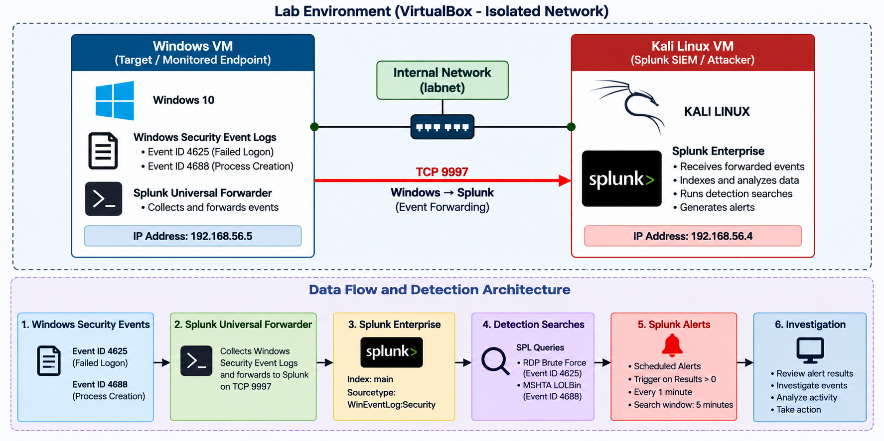

\# Splunk Security Detection


A hands-on SIEM project using \*\*Splunk\*\* to analyse Windows Security Event
Logs and detect suspicious activity.

The project focuses on two detections:

\- RDP Brute Force
\- MSHTA LOLBin


\## Lab Environment

The project uses two virtual machines:

\- \*\*Windows VM\*\* — monitored/target machine

\- \*\*Kali Linux VM\*\* — Splunk Enterprise and security analysis


The Windows VM generates security events that are collected and analysed

in Splunk.


\## Architecture



The complete architecture and data flow are documented here:

\[View Architecture](docs/architecture.md)


\## Detection 1 — RDP Brute Force

The RDP detection uses Windows Security Event ID `4625`, which represents
a failed logon attempt.

The events are analysed using the account name, source network address and
number of failed attempts to identify repeated authentication failures.


\*\*MITRE ATT\&CK:\*\* `T1110 - Brute Force`

\[View RDP Detection](splunk/alerts/rdp-brute-force.md)

\### Evidence

!\[RDP Search](screenshots/RDPSearch.png)


!\[RDP Triggered Events](screenshots/RDPTriggeredEvents.png)


\## Detection 2 — MSHTA LOLBin

The MSHTA detection uses Windows Security Event ID `4688`, which represents
process creation.

The detection looks for `mshta.exe` activity and relevant command-line
indicators.


\*\*MITRE ATT\&CK:\*\* `T1218.005 - Mshta`

\[View MSHTA Detection](splunk/alerts/mshta-lolbin.md)

\### Evidence

!\[MSHTA Triggered Events](screenshots/mshtaTriggeredEvents.png)

\## Investigation

The investigation process is documented separately:

\[View Investigation](splunk/investigation.md)

The investigation focuses on the information available in the detected
events, including accounts, source addresses, process information,
command lines and timestamps.


\## Splunk Configuration


The project also contains documentation for the Splunk configuration used
during the setup:

\[View Configuration](splunk/configuration/README.md)


\## Project Structure

```text

splunk-security-detection/

│

├── README.md

│

├── docs/

│   └── architecture.md

│

├── screenshots/

│   ├── architecture.png

│   ├── jobMgmtAlert.png

│   ├── mshtaTriggeredEvents.png

│   ├── queryTable.png

│   ├── RDPSearch.png

│   └── RDPTriggeredEvents.png

│

└── splunk/

   ├── alerts/

   │   ├── mshta-lolbin.md

   │   └── rdp-brute-force.md

   │

   ├── configuration/

   │   └── README.md

   │

   └── investigation.md

---

# Technologies Used

- **Splunk Enterprise**
- **SPL (Search Processing Language)**
- **Splunk Universal Forwarder**
- **Windows Security Event Logs**
- **Windows**
- **Kali Linux**
- **MITRE ATT&CK**

---

# Skills Demonstrated

- SIEM monitoring
- Security event analysis
- SPL query development
- Windows event investigation
- Detection engineering
- Splunk alert configuration
- Security investigation
- MITRE ATT&CK mapping
- Log analysis

---

# Project Takeaway

This project provided practical experience in using a SIEM to move from raw
Windows security events to usable security detections.

It involved creating SPL searches, testing the detections, configuring alerts,
reviewing the resulting events and documenting the investigation process.

